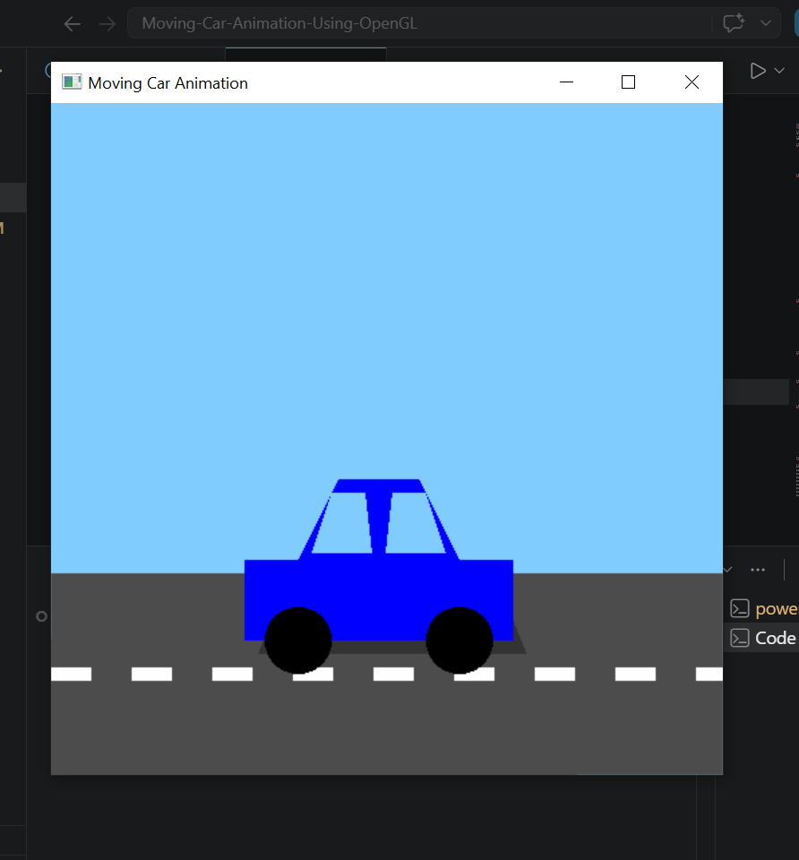
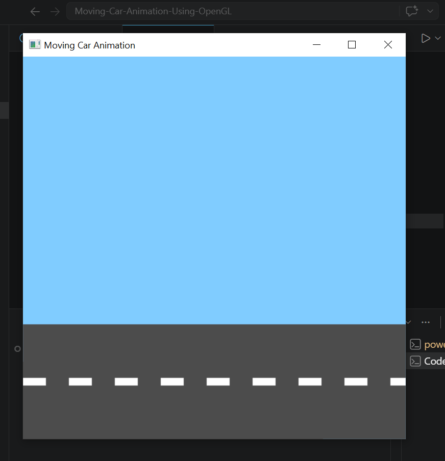

# 🚗 Real-Time 2D Car Animation Using OpenGL and Python

A simple and interactive **Computer Graphics Lab Project** developed using Python, OpenGL, and GLUT.  
This project demonstrates a moving 2D car animation with road environment, shadow effects, and mouse-controlled speed interaction.

---

# 📌 Project Overview

This project is designed for beginners who want to learn:

- Basic OpenGL drawing
- 2D animation
- Mouse interaction
- Real-time rendering
- Computer graphics concepts

The car continuously moves across the road, and users can control the speed using mouse clicks.

---

# ✨ Features

✅ Real-time moving car animation  
✅ Road environment  
✅ Car shadow effect  
✅ Mouse-based speed control  
✅ Smooth animation using double buffering  
✅ Beginner-friendly OpenGL project  
✅ Simple and clean Python code  

---

# 🛠 Technologies Used

- Python
- PyOpenGL
- GLUT
- OpenGL

---

# 🎮 Mouse Controls

| Mouse Button | Action |
|---|---|
| Left Click | Increase car speed |
| Right Click | Decrease car speed |

---

# 📷 Demo Screenshots

## Demo Image 1



---

## Demo Image 2



---

# 🎥 Demo Video

YouTube Demo Video:
    (Video.mp4)

👉 https://www.youtube.com/watch?v=YOUR_VIDEO_LINK

---

# 📂 Project Structure

```bash
Moving-Car-Animation/
│
├── main.py
├── README.md
├── images/
│   ├── demo1.png
│   └── demo2.png
│
└── requirements.txt
```

---

# ⚙️ Installation Guide

## 1️⃣ Clone Repository

```bash
git clone https://github.com/JNRCHAYAN/Moving-Car-Animation-Using-OpenGL.git
```

---

## 2️⃣ Open Project Folder

```bash
cd Moving-Car-Animation
```

---

## 3️⃣ Install Required Libraries

```bash
pip install PyOpenGL PyOpenGL_accelerate
```

---

# ▶️ Run the Project

```bash
python main.py
```

---

# 📚 Computer Graphics Concepts Used

- OpenGL primitives
- 2D transformations
- Polygon drawing
- Animation loop
- Double buffering
- Mouse interaction
- Coordinate system

---

# 🧠 Learning Outcomes

After completing this project, students can understand:

- Basic OpenGL rendering
- Real-time object movement
- Interactive graphics programming
- Event handling using mouse
- Basic computer graphics pipeline

---

# 🚀 Future Improvements

You can improve this project by adding:

- Traffic signals
- Day/Night mode
- Keyboard controls
- Multiple cars
- Headlight effect
- Building and tree environment
- Sound effects
- 3D version of the project

---

# 👨‍💻 Author

Developed by: Chayan Roy

---

# ⭐ Support

If you like this project, give it a ⭐ on GitHub.
